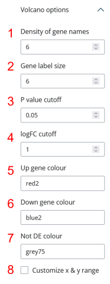

```{r, include = FALSE}
knitr::opts_chunk$set(
    collapse = TRUE,
    comment = "#>"
)
```

## Introduction

shinyDSP: Analyzing and Visualizing Nanostring GeoMx DSP Data

shinyDSP is an intuitive Shiny application designed for the comprehensive
analysis and visualization of [Nanostring GeoMx
DSP](https://nanostring.com/products/geomx-digital-spatial-profiler/geomx-dsp-overview/)
data. Users can upload either demo or custom datasets, consisting of count and
sample annotation tables. The app prompts users to select variables of interest,
potential batch effects, and confounding factors, allowing for customized
exploration.

With shinyDSP, users can create x-y scatter plots of any combination of
categorical variables and apply user-defined cutoffs to filter samples. The app
utilizes the R package, standR [@liu_standr_2023], to perform normalization
using methods such as CPM, upper quartile (Q3), or RUV4 (Remove Unwanted
Variation). Users can visualize PCA plots generated for each normalization
method, color-coded by chosen variables or batch.

After selecting a normalization scheme, users can identify differentially
expressed genes between specified biological groups using limma-voom
[@ritchie_limma_2015]. The app provides "raw" output numbers in tables,
generates volcano plots for all pairwise comparisons, and displays heatmaps of
the top differentially expressed genes.

shinyDSP aims to provide a robust, start-to-finish analysis of GeoMx data,
producing publication-ready outputs that are easily customizable to meet
individual aesthetic preferences.

## Installation

```{r installation, eval = FALSE}
if (!requireNamespace("BiocManager", quietly = TRUE)) {
    install.packages("BiocManager")
}

BiocManager::install("shinyDSP")

# To install the development version from Github:
if (!requireNamespace("devtools", quietly = TRUE)) {
    install.packages("devtools")
}

devtools::install_github("kimsjune/shinyDSP")

library(shinyDSP)
```

## Usage

```{r usage, eval = FALSE}
library(shinyDSP)
app <- shinyDSP()
# This will open a new browser tab/window.
if (interactive()) shiny::runApp(app)
```

## User interface

{style="display: block; margin: 1em auto;" width="100%"}

There are four main UI components:\
1. The `nav bar` where `nav panels` will appear. `Setup` is a `nav panel`.\
2. The main `side bar`. This is where you can set global parameters.\
3. The main display within each `nav panel`. This is where outputs will appear.\
4. A `side bar` within the `setup` `nav panel`. This is where customization
options will appear.

## Loading data

shinyDSP requires count and annotation tables (in .csv or .txt format) as input.
These tables are generated with DSP Data Analysis (DSPDA) software. To see how
these files should be formatted, click on "Use [demo
data](https://nanostring.com/products/geomx-digital-spatial-profiler/spatial-organ-atlas/human-kidney/)",
then "Load data". The top 10 rows of each table will be shown in the main
display.

The main `side bar` will also be updated with various options.

{style="display: block; margin: 1em auto;"
width="50%"}

1\. You can pick one or more variables of interest. It's common to combine two
variables into one grouped variable. For example, "genotype" and "treatment" can
be combined into "genotype_treatment". A new column in your annotation table is
automatically created.\
2. A batch variable. "SlideName" is selected by default, but it could be any
categorical variable provided in the annotation table such as "sample
preparation batch", etc.\
3. Any confounding variable(s) such as age or sex of your samples that you want
to include in the design matrix for differential gene expression analysis. None
selected by default.

For this demo, "disease_status" and "region" are selected as the variables of
interest. All four groups of interest are selected (DKD_glomerulus, DKD_tubule,
normal_tubule, normal_glomerulus). After selecting "Variable(s) of interest",
two new `nav panels` appear: "QC" and "PCA".

## QC

Click on the "QC" `nav panel` to create scatter plots and (optionally) filter
samples not meeting cutoffs.
{style="display: block; margin: 1em auto;"
width="50%"}

1\. Pick **two** or more quantitative variables to plot and (optionally)
filter.\
2. If you select more than two variables, increase this number to show all
possible x-y plots.\
3. Pick a variable for the colour legend. "SlideName" is the default.\
4. Pick one of the five colour palettes. "glasbey" is the default.\
5. Click to open. You have the option of providing minimum threshold value(s) for each variable from
(1).

Lastly, click on "Show QC plots" to show/update the plots.

{width="100%"} In the example above,
"SequencingSaturation" and "DeduplicatedReads" were selected. Then, I removed
any samples with "SequencingSaturation" below 85. No filtering was applied based
on "DeduplicatedReads".

The scatter plot can be saved as .png, .tiff, .svg or .pdf by clicking the
download buttons below each plot.

Now we move on to "PCA" (click on the `nav panel`).

## PCA

{style="display: block; margin: 1em auto;" width="50%"}

Click on "Run" to generate PCA plots. For each group of interest and batch
variable that you selected in the main `side bar`, you can pick its shape and
colour. For example, "DKD_glomerulus" will appear as black circles. You can pick
between five different shapes and any colour in [grDevices::colours()]().

Two sets of three PCA plots are generated in the main display area. Three
normalization schemes are shown: CPM, Q3 (upperquartile), and RUV4 (Remove
Unwanted Variation). Across the top and buttom row, the plots are colour-coded
by "Variable(s) of interest", and the "batch variable", respectively. Click on
"Download" in the `side bar` to find all the download options.

Select the smallest value of "k value for RUV4 norm." that removes any batch effect. Click on "Run" to show updated plots.

## Normalization

{style="display: block; margin: 1em auto;" width="50%"}

Now you can choose the normalization scheme to use for differential gene expression testing and the log fold-change cutoff for [limma::topTable](https://www.rdocumentation.org/packages/limma/versions/3.28.14/topics/toptable). Selecting a normalization scheme will reveal three new `nav panels` in the `nav bar`: "Table", "Volcano", and "Heatmap".

{style="display: block; margin: 1em auto;" width="100%"}

> If you choose "RUV4", you need to open the "PCA" `nav panel` to load the k value.

## Table

Clicking on the "Table" `nav panel` will automatically start performing differential gene expression testing between all selected "Groups of interest". If more than two groups were selected, all possible pairwise comparisons *and* an ANOVA-like test between all groups are executed. This step can take about 3 minutes. Results are separated into `tabs` highlighted in blue. Click on the "Download table" button below each table to download it (in .csv).

{style="display: block; margin: 1em auto;" width="100%"}

## Volcano plots 

Click on the "Volcano" `nav panel` and "Show/update".  

{style="display: block; margin: 1em auto;" width="100%"}

Like the tables, Volcano plots are shown in individual `tabs` highlighted in blue. 

{style="display: block; margin: 1em auto;" width="50%"}

There are several customization options for tweaking the look and feel of these plots.  
1. Higher number increases the number of gene names shown by allowing them to overlap each other.  
2. Higher number makes the labels larger.  
3-4. These options are used to colour those genes not meeting cutoffs to have "Not DE colour (7)".  
5. Those genes with logFC >= "logFC cutoff" are given this colour. Must be a grDevices::color().  
6. Those genes with logFC <= -"logFC cutoff" are given this colour. Must be a grDevices::color()".  
7. Must be a grDevices::color().  
8. Click to enable custom x and y ranges.   

These settings are applied to all Volcano plots. Below each Volcano plot, you have the option to save it as four different file types. 

## Heatmap

For each "Table", a corresponding heatmap is generated. The heatmaps are also organized into individual `tabs`. By default, the top 50 genes (sorted by adjusted P value) are shown as rows, clustered based on Euclidean distances. There are a few customization options:  

{style="display: block; margin: 1em auto;" width="50%"}

1. Any N top genes can be plotted.  
2. The [viridis](https://cran.r-project.org/web/packages/viridis/vignettes/intro-to-viridis.html) colour map is available.  
3. A custom range of Z score. Does not have to be balanced.  
4. This adjusts the overall size of the **downloaded* heatmap. Each "square" will become smaller/bigger.  
5. Font size for row/gene labels.  

Below each heatmap, you have the option to save it as four different file types. 


## Session Info

```{r sessionInfo} 
sessionInfo()
```
